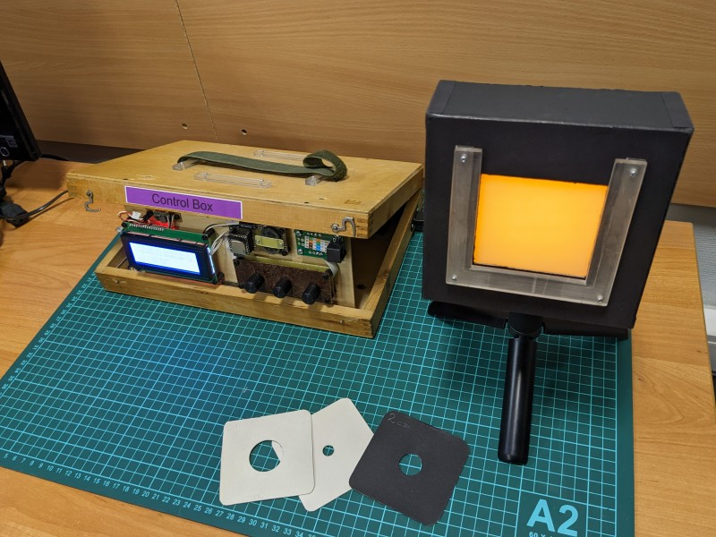
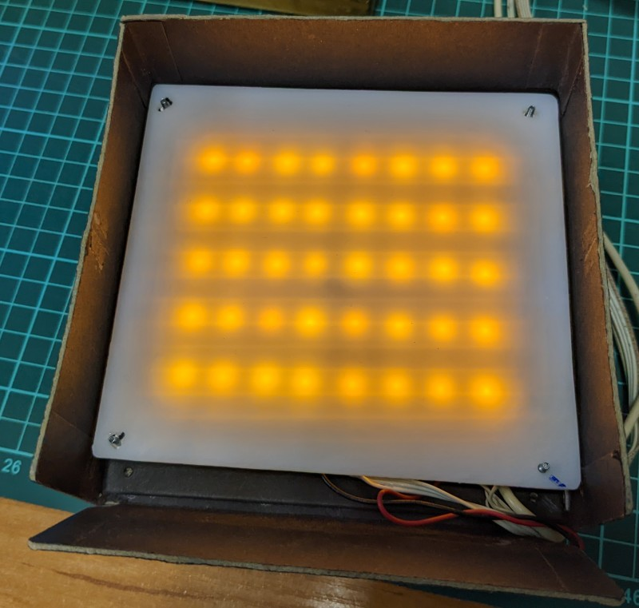
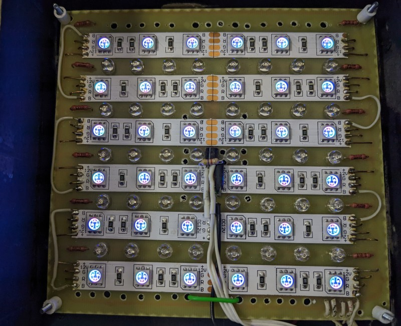

Stumulus Display project goal is to ease color thresholds measurements with replacement colorimetry.

The device consists of the “Control Box” with electronics and “Stimulus Box” with LEDs and fans.

Off-the-shelf electronic components are used in the device:

Control Box – Arduino Leonardo, PSU MeanWell 12V 2A, EC11 rotary encoders, LCD display 20x4;

Stimulus Box – decorative RGB LED strips, digital thermometer DS18B20, fans Evercool EC6015M12B (60x60x15 mm).

Stimulus Box was made of binding board, has dimensions 135x135x50 mm.

Inside the box there are two diffuse plastic plates (one mounted in the cover),

PCB with LED strips, digital thermometer.

Fans are mounted at the back side of the box, there are holes in the box and the PCB for the air flow.

Stimulus box is accompanied with set of exchangeable diaphragms with round holes of various diameters.

Control box software  allows to set color center in CIE xyY color coordinates,
JND measurements in polar coordinates, stimuli replacement with a minimum interval of 10ms.
